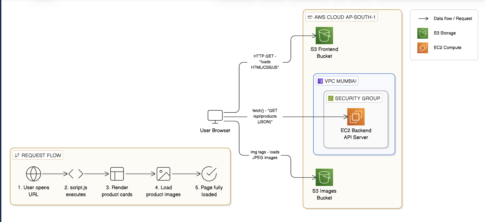

# 🛍️ Product Catalog — Complete Project Documentation

> **Project**: ShopVista — A Product Catalog Website on AWS  
> **Date**: 23 February 2026  
> **Team Size**: 4 Members

> **Team Members**: 
> - Member 1: Dhairya Jain
> - Member 2: Kaustubh Nair
> - Member 3: Suryansh Gehlot
> - Member 4: Ankit Luhar

> **AWS Region**: ap-south-1 (Mumbai)  
> **Frontend URL**: http://product-catalog-frontend-123.s3-website.ap-south-1.amazonaws.com  
> **API URL**: http://13.127.85.195:5000/api/products  
> **Images Bucket**: https://products-images-123.s3.ap-south-1.amazonaws.com

---

## 📑 Table of Contents

1. [Project Overview](#1-project-overview)
2. [Architecture & Workflow Diagrams](#2-architecture--workflow-diagrams)
3. [AWS Services Used](#3-aws-services-used)
4. [What We Built — Step by Step](#4-what-we-built--step-by-step)
5. [Detailed Component Breakdown](#5-detailed-component-breakdown)
6. [How the Components Talk to Each Other](#6-how-the-components-talk-to-each-other)
7. [Deployment Workflow](#7-deployment-workflow)
8. [CloudWatch Monitoring & Alerts](#8-cloudwatch-monitoring--alerts)
9. [Key AWS Concepts Explained](#9-key-aws-concepts-explained)
10. [Common Issues & Troubleshooting](#10-common-issues--troubleshooting)
11. [Cleanup & Cost Management](#11-cleanup--cost-management)

---

## 1. Project Overview

### What is this project?
We built a **Product Catalog Website** — a web page that displays a list of products (like an online store) using three AWS services working together.

### What does it do?
- A user opens a website in their browser
- The website loads from **Amazon S3** (a cloud storage service)
- The website calls a **REST API** running on **Amazon EC2** (a cloud server) to get product data
- Product images are loaded from a **separate S3 bucket** directly into the browser

### Why these technologies?
| Choice | Why? |
|--------|------|
| **S3 for frontend** | No need to manage a web server for static files (HTML/CSS/JS) — S3 does it for free |
| **EC2 for backend** | We need a server to run Python code (Flask API) that processes requests |
| **S3 for images** | Images are static files — S3 is cheaper and faster for serving them than EC2 |
| **Flask (Python)** | Simple, beginner-friendly web framework for building REST APIs |
| **CloudWatch** | Monitor EC2 health in real time and get email alerts if something goes wrong |


---

## 2. Architecture & Workflow Diagrams




### 2.1 High-Level Architecture

```
┌─────────────────────────────────────────────────────────────────────┐
│                        USER'S BROWSER                               │
│                                                                     │
│   1. Loads webpage    2. Fetches product     3. Loads product       │
│      from S3 ────►       data from EC2 ────►    images from S3      │
└─────────┬───────────────────┬─────────────────────┬─────────────────┘
          │                   │                     │
          ▼                   ▼                     ▼
┌─────────────────┐ ┌─────────────────────┐ ┌─────────────────┐
│   S3 BUCKET #1  │ │   EC2 INSTANCE      │ │   S3 BUCKET #2  │
│   (Frontend)    │ │   (Backend API)     │ │   (Images)      │
│                 │ │                     │ │                 │
│ ┌─────────────┐ │ │ ┌─────────────────┐ │ │ ┌─────────────┐ │
│ │ index.html  │ │ │ │ Flask App       │ │ │ │product1.jpeg│ │
│ │ style.css   │ │ │ │ (app.py)        │ │ │ │product2.jpeg│ │
│ │ script.js   │ │ │ │                 │ │ │ │product3.jpeg│ │
│ └─────────────┘ │ │ │ products.json   │ │ │ │product4.jpeg│ │
│                 │ │ │ (product data)  │ │ │ │product5.jpeg│ │
│ Static Website  │ │ │                 │ │ │ │product6.jpeg│ │
│ Hosting Enabled │ │ │Port: 5000       │ │ │ └─────────────┘ │
└─────────────────┘ │ │IP: 13.127.85.195│ │ │ Public Read     │
                    │ └─────────────────┘ │ │ Access Enabled  │
                    │ Security Group:     │ └─────────────────┘
                    │ - SSH (22)          │
                    │ - HTTP (80)         │         ▲
                    │ - Flask (5000)      │         │
                    └─────────────────────┘         │ Monitored by
                              │                     │
                              ▼                     │
                    ┌─────────────────────┐         │
                    │   CLOUDWATCH        │─────────┘
                    │   - CPU Alarm       │
                    │   - Network Alarm   │
                    │   - Dashboard       │
                    │        │            │
                    │        ▼            │
                    │   SNS TOPIC         │
                    │   (Email Alert)     │
                    └─────────────────────┘
```

### 2.2 Request Flow — What Happens When a User Visits the Website

```
    USER opens website URL in browser
              │
              ▼
    ┌─────────────────────────────┐
    │ STEP 1: Load the Web Page   │
    │                             │
    │ Browser sends HTTP GET to   │
    │ S3 Frontend Bucket URL      │
    │                             │
    │ S3 returns:                 │
    │  • index.html (structure)   │
    │  • style.css (design)       │
    │  • script.js (logic)        │
    └──────────────┬──────────────┘
                   │
                   ▼
    ┌─────────────────────────────┐
    │ STEP 2: Fetch Product Data  │
    │                             │
    │ script.js executes and      │
    │ calls: fetch() to           │
    │ http://13.127.85.195:5000   │
    │        /api/products        │
    │                             │
    │ EC2 Flask API returns:      │
    │  • JSON array of products   │
    │  • Each product has name,   │
    │    price, description,      │
    │    image URL, category      │
    └──────────────┬──────────────┘
                   │
                   ▼
    ┌─────────────────────────────┐
    │ STEP 3: Render Products     │
    │                             │
    │ script.js creates HTML      │
    │ cards for each product      │
    │ and inserts them into       │
    │ the page (DOM)              │
    │                             │
    │ Each card has an  tag  │
    │ pointing to S3 image URL    │
    └──────────────┬──────────────┘
                   │
                   ▼
    ┌─────────────────────────────┐
    │ STEP 4: Load Images         │
    │                             │
    │ Browser sees  tags     │
    │ and sends GET requests to   │
    │ S3 Images Bucket:           │
    │                             │
    │ https://products-images-123 │
    │ .s3.ap-south-1.amazonaws    │
    │ .com/product1.jpeg          │
    │                             │
    │ S3 returns the image files  │
    │ directly to the browser     │
    └──────────────┬──────────────┘
                   │
                   ▼
    ┌─────────────────────────────┐
    │ STEP 5: Page Fully Loaded!  │
    │                             │
    │ User sees the complete      │
    │ product catalog with:       │
    │  ✓ Product names & prices   │
    │  ✓ Product descriptions     │
    │  ✓ Product images           │
    │  ✓ Category filters         │
    │  ✓ Search functionality     │
    └─────────────────────────────┘
```

### 2.3 Development & Deployment Workflow

```
    LOCAL DEVELOPMENT (Your Mac/Laptop)
    ====================================

    ┌─────────────────────────────────────────────────┐
    │                                                 │
    │   member1-frontend/        member2-backend/     │
    │   ├── index.html           ├── app.py           │
    │   ├── style.css            ├── products.json    │
    │   └── script.js            └── requirements.txt │
    │                                                 │
    └──────────┬──────────────────────┬───────────────┘
               │                      │
          Upload to S3           Upload via SCP
          (AWS Console)          (Terminal command)
               │                      │
               ▼                      ▼
    ┌──────────────────┐   ┌──────────────────────┐
    │  S3 BUCKET       │   │  EC2 INSTANCE        │
    │  (Frontend)      │   │  (13.127.85.195)     │
    │                  │   │                      │
    │  Static Website  │   │  Flask runs on       │
    │  Hosting ON      │   │  port 5000           │
    └──────────────────┘   └──────────────────────┘
                                      │
                                      │ Monitored by
                                      ▼
                           ┌──────────────────────┐
                           │  CLOUDWATCH          │
                           │  Dashboard + Alarms  │
                           └──────────────────────┘


    DEPLOYMENT COMMANDS USED:
    =========================

    ┌──────────────────────────────────────────────────────────┐
    │                                                          │
    │  # 1. Set PEM file permissions (one-time)                │
    │  chmod 400 ~/Downloads/shopvista-key.pem                 │
    │                                                          │
    │  # 2. Upload backend files to EC2 via SCP                │
    │  scp -i ~/Downloads/shopvista-key.pem \                  │
    │      app.py products.json requirements.txt \             │
    │      ec2-user@13.127.85.195:~/                           │
    │                                                          │
    │  # 3. SSH into EC2                                       │
    │  ssh -i ~/Downloads/shopvista-key.pem \                  │
    │      ec2-user@13.127.85.195                              │
    │                                                          │
    │  # 4. Install dependencies (on EC2)                      │
    │  sudo yum install python3 python3-pip -y                 │
    │  pip3 install flask flask-cors                           │
    │                                                          │
    │  # 5. Run Flask API in background (on EC2)               │
    │  nohup python3 app.py > flask.log 2>&1 &                 │
    │                                                          │
    │  # 6. Upload frontend to S3 via AWS Console              │
    │  (Manual upload through S3 web interface)                │
    │                                                          │
    └──────────────────────────────────────────────────────────┘
```

### 2.4 Network & Security Diagram

```
    INTERNET
        │
        │  User's browser connects via HTTP
        │
        ▼
    ┌───────────────────────────────────────┐
    │         AWS CLOUD (ap-south-1)        │
    │                                       │
    │  ┌─────────────────────────────────┐  │
    │  │     VPC (Virtual Private Cloud) │  │
    │  │                                 │  │
    │  │  ┌───────────────────────────┐  │  │
    │  │  │  SECURITY GROUP           │  │  │
    │  │  │  (Firewall Rules)         │  │  │
    │  │  │                           │  │  │
    │  │  │  Inbound Rules:           │  │  │
    │  │  │  ┌──────┬────────┬─────┐  │  │  │
    │  │  │  │ Port │ Proto  │ Src │  │  │  │
    │  │  │  ├──────┼────────┼─────┤  │  │  │
    │  │  │  │  22  │ SSH    │My IP│  │  │  │
    │  │  │  │  80  │ HTTP   │ All │  │  │  │
    │  │  │  │ 5000 │ Custom │ All │  │  │  │
    │  │  │  └──────┴────────┴─────┘  │  │  │
    │  │  │                           │  │  │
    │  │  │  ┌─────────────────────┐  │  │  │
    │  │  │  │   EC2 INSTANCE      │  │  │  │
    │  │  │  │   t2.micro          │  │  │  │
    │  │  │  │   Amazon Linux 2    │  │  │  │
    │  │  │  │   IP: 13.127.85.195 │  │  │  │
    │  │  │  │   Flask on :5000    │  │  │  │
    │  │  │  └─────────────────────┘  │  │  │
    │  │  └───────────────────────────┘  │  │
    │  └─────────────────────────────────┘  │
    │                                       │
    │  ┌─────────────────────────────────┐  │
    │  │  S3 BUCKET (Frontend)           │  │
    │  │  Policy: Public Read (GetObject)│  │
    │  │  Static Website Hosting: ON     │  │
    │  └─────────────────────────────────┘  │
    │                                       │
    │  ┌─────────────────────────────────┐  │
    │  │  S3 BUCKET (Images)             │  │
    │  │  products-images-123            │  │
    │  │  Policy: Public Read (GetObject)│  │
    │  │  CORS: GET from all origins     │  │
    │  └─────────────────────────────────┘  │
    │                                       │
    │  ┌─────────────────────────────────┐  │
    │  │  CLOUDWATCH                     │  │
    │  │  Dashboard: ShopVista-Dashboard │  │
    │  │  Alarm: ShopVista-High-CPU      │  │
    │  │  Alarm: ShopVista-High-Network  │  │
    │  │        │                        │  │
    │  │        ▼                        │  │
    │  │  SNS Topic: shopvista-alerts    │  │
    │  │  → Email notification on alarm  │  │
    │  └─────────────────────────────────┘  │
    │                                       │
    └───────────────────────────────────────┘
```

---

## 3. AWS Services Used

### 3.1 Amazon S3 (Simple Storage Service)

| What | Details |
|------|---------|
| **What is it?** | Cloud storage service — like Google Drive but for websites and apps |
| **Why we used it** | To host our static website (HTML/CSS/JS) and store product images |
| **How many buckets?** | 2 — one for frontend files, one for product images |
| **Key feature used** | **Static Website Hosting** — S3 can act as a web server for static files |
| **Cost** | Free Tier: 5GB storage, 20,000 GET requests/month |

**Key Concepts:**
- **Bucket** = A container (folder) in the cloud where you store files
- **Object** = Any file stored in a bucket (HTML file, image, etc.)
- **Bucket Policy** = Rules that control who can access the files
- **Static Website Hosting** = A setting that makes S3 serve files like a web server
- **CORS** = Cross-Origin Resource Sharing — allows your frontend (S3 bucket #1) to load images from another domain (S3 bucket #2)

### 3.2 Amazon EC2 (Elastic Compute Cloud)

| What | Details |
|------|---------|
| **What is it?** | A virtual server (computer) in the cloud that you can SSH into and run code |
| **Why we used it** | To run our Python Flask REST API |
| **Instance type** | `t2.micro` (1 vCPU, 1GB RAM — Free Tier eligible) |
| **AMI** | Amazon Linux 2 (operating system) |
| **Our IP** | `13.127.85.195` |
| **Cost** | Free Tier: 750 hours/month of t2.micro |

**Key Concepts:**
- **Instance** = A single virtual server
- **AMI (Amazon Machine Image)** = The operating system template (like choosing Windows vs Mac vs Linux)
- **Key Pair (.pem file)** = A security file used instead of a password to SSH into the server
- **Security Group** = A virtual firewall that controls which network traffic can reach your server
- **Public IP** = The internet address of your EC2 instance
- **SSH** = A protocol to securely connect to a remote server via terminal

### 3.3 Amazon CloudWatch

| What | Details |
|------|---------|
| **What is it?** | AWS monitoring and observability service — tracks metrics, logs, and events |
| **Why we used it** | To monitor our EC2 instance health and get email alerts if something goes wrong |
| **What we monitor** | CPU utilization, NetworkIn, NetworkOut |
| **Alarms created** | 2 — one for high CPU, one for high network traffic |
| **Cost** | Free Tier: 10 alarms, 3 dashboards, 5GB logs/month |

**Key Concepts:**
- **Metric** = A data point measured over time (e.g., CPU usage at 5-minute intervals)
- **Alarm** = A rule that watches a metric and triggers an action when it crosses a threshold
- **Dashboard** = A visual panel showing multiple metrics and alarm statuses in one place
- **SNS (Simple Notification Service)** = The service that sends email alerts when an alarm fires


---

## 4. What We Built — Step by Step

Here's a chronological record of everything we did:

### Phase 1: Project Setup (Local Development)

```
Step 1 ──► Created the project folder structure
           AWS_assignment/
           ├── member1-frontend/    (HTML, CSS, JS)
           ├── member2-backend/     (Flask API)
           ├── member3-images/      (S3 config, images)
           └── member4-integration/ (Docs, testing)

Step 2 ──► Built the Frontend (Member 1)
           • index.html — Page structure with header, hero, product grid
           • style.css  — Dark-mode premium design with animations
           • script.js  — Fetch API calls, search, category filtering

Step 3 ──► Built the Backend API (Member 2)
           • app.py          — Flask REST API with 3 endpoints
           • products.json   — 6 sample products with details
           • requirements.txt — Flask + flask-cors dependencies

Step 4 ──► Tested Locally
           • Started Flask: python3 app.py (port 5000)
           • Opened index.html in browser
           • Verified API returns product data ✅
           • Verified frontend renders cards ✅
```

### Phase 2: AWS Setup & Deployment

```
Step 5 ──► Set Up S3 Images Bucket (Member 3)
           • Created bucket: products-images-123
           • Region: ap-south-1 (Mumbai)
           • Disabled "Block all public access"
           • Added bucket policy for public read
           • Configured CORS for cross-origin image loading
           • Uploaded 6 product images (product1.jpeg → product6.jpeg)

Step 6 ──► Updated Image URLs
           • Changed products.json to use real S3 URLs:
             https://products-images-123.s3.ap-south-1.amazonaws.com/product1.jpeg

Step 7 ──► Launched EC2 Instance (Member 2)
           • AMI: Amazon Linux 2
           • Type: t2.micro (Free Tier)
           • Created key pair: shopvista-key.pem
           • Configured Security Group:
             - Port 22  (SSH)  — For terminal access
             - Port 80  (HTTP) — For web traffic
             - Port 5000       — For Flask API
           • Got Public IP: 13.127.85.195

Step 8 ──► Fixed PEM Permissions
           • chmod 400 ~/Downloads/shopvista-key.pem
           • (Required by SSH — file must be read-only)

Step 9 ──► Uploaded Code to EC2 via SCP
           • Command run FROM LOCAL Mac (not from inside EC2!):
             scp -i shopvista-key.pem app.py products.json 
                 requirements.txt ec2-user@13.127.85.195:~/

Step 10 ─► Installed Dependencies on EC2
           • SSH'd into EC2
           • Installed Python3 and pip
           • Installed Flask and flask-cors

Step 11 ─► Started Flask API on EC2
           • nohup python3 app.py > flask.log 2>&1 &
           • (nohup keeps it running even after closing SSH)
           • Verified: curl http://13.127.85.195:5000/health ✅

Step 12 ─► Updated Frontend API URL
           • Changed script.js:
             const API_BASE_URL = 'http://13.127.85.195:5000';

Step 13 ─► Upload Frontend to S3 (Member 1)
           • Upload index.html, style.css, script.js to 
             S3 frontend bucket with static hosting enabled
```

### Phase 3: CloudWatch Monitoring Setup

```
Step 14 ─► Created CloudWatch Dashboard
           • Dashboard name: ShopVista-Dashboard
           • Added widgets: CPUUtilization, NetworkIn, NetworkOut
           • All metrics tied to shopvista-instance

Step 15 ─► Set Up SNS Email Alerts
           • Created SNS topic: shopvista-alerts
           • Subscribed team email
           • Confirmed subscription via email link ✅

Step 16 ─► Created CloudWatch Alarms
           • Alarm 1: ShopVista-High-CPU
             - Metric: CPUUtilization > 70% for 5 minutes
             - Action: Email via shopvista-alerts SNS topic
           • Alarm 2: ShopVista-High-Network
             - Metric: NetworkIn > 5,000,000 bytes (5MB)
             - Action: Email via shopvista-alerts SNS topic

Step 17 ─► Added Alarm Status Widget to Dashboard
           • Dashboard now shows live graphs + alarm status panel
           • Full observability of EC2 instance in one view ✅
```

---

## 5. Detailed Component Breakdown

### 5.1 Frontend Files

#### `index.html` — The Page Structure
```
What it contains:
├── <header>  — Navigation bar with logo, category links, search box
├── <section> — Hero section with title and stats
├── <main>    — Product grid area with loading/error/empty states
└── <footer>  — Site credits and AWS services info
```

#### `style.css` — The Visual Design
```
Design features:
├── Dark mode theme (deep navy/purple background)
├── Glassmorphism (frosted glass effect on header)
├── Gradient text effects (logo, headings, prices)
├── Responsive grid (4 columns → 2 → 1 on mobile)
├── Hover animations (card lift + glow effect)
├── Loading spinner animation
└── Smooth fade-in animations for product cards
```

#### `script.js` — The Application Logic
```
What it does:
├── fetchProducts()    — Calls EC2 API, gets product JSON
├── renderProducts()   — Creates HTML cards from product data
├── setupEventListeners() — Search input + category nav clicks
├── getFilteredProducts() — Filters by category and search query
├── showState()        — Toggles loading/error/empty/products views
└── Error handling     — Shows retry button if API is unreachable
```

### 5.2 Backend Files

#### `app.py` — Flask REST API
```
Endpoints:
├── GET /                    → API info and available endpoints
├── GET /health              → Health check: {"status": "healthy"}
├── GET /api/products        → Returns ALL products (JSON array)
├── GET /api/products/<id>   → Returns ONE product by ID
└── GET /api/products?category=Electronics → Filter by category

Key features:
├── CORS enabled (flask-cors) — allows S3 frontend to call the API
├── Runs on 0.0.0.0:5000     — accessible from outside EC2
└── Reads data from products.json file
```

#### `products.json` — Product Database
```json
[
  {
    "id": 1,
    "name": "Wireless Noise-Cancelling Headphones",
    "price": 2499,
    "description": "Premium over-ear headphones...",
    "image": "https://products-images-123.s3.ap-south-1.amazonaws.com/product1.jpeg",
    "category": "Electronics"
  },
  ... (6 products total: 3 Electronics, 2 Clothing, 1 Accessories)
]
```

### 5.3 CloudWatch Configuration

#### Dashboard — `ShopVista-Dashboard`
```
Widgets:
├── Line graph: CPUUtilization    — % CPU used by EC2 over time
├── Line graph: NetworkIn         — Bytes received by EC2 over time
├── Line graph: NetworkOut        — Bytes sent by EC2 over time
└── Alarm status panel            — Visual status of both alarms
```

#### Alarms
```
ShopVista-High-CPU:
├── Metric:    CPUUtilization (shopvista-instance)
├── Period:    5 minutes
├── Condition: Average > 70%
└── Action:    Email via SNS topic shopvista-alerts

ShopVista-High-Network:
├── Metric:    NetworkIn (shopvista-instance)
├── Period:    5 minutes
├── Condition: Average > 5,000,000 bytes
└── Action:    Email via SNS topic shopvista-alerts
```

#### SNS Topic — `shopvista-alerts`
```
Type:     Standard
Protocol: Email
Status:   Confirmed ✅
Purpose:  Sends email to team when any alarm fires
```

---

## 6. How the Components Talk to Each Other

### 6.1 API Communication (Frontend → Backend)

```
Frontend (script.js)                    Backend (app.py on EC2)
─────────────────────                   ──────────────────────

fetch('http://13.127.85.195:5000       Flask receives the request
      /api/products')                   ─────────────────────────
        │                                       │
        │  HTTP GET Request                     │  
        │  ──────────────────────────►          │
        │                                       ▼
        │                               load_products()
        │                               reads products.json
        │                               returns Python list
        │                                       │
        │                                       ▼
        │                               jsonify(products)
        │                               converts to JSON string
        │                                       │
        │  HTTP 200 Response                    │
        │  Content-Type: application/json       │
        │  ◄──────────────────────────-----------          
        │                                       
        ▼                               
response.json()                         
parses JSON → JavaScript array          
        │
        ▼
renderProducts(products)
creates HTML cards
inserts into DOM
```

### 6.2 Image Loading (Browser → S3)

```
For each product card:


        │
        │  Browser automatically sends
        │  HTTP GET to S3
        │
        ▼
  S3 Images Bucket
  ─────────────────
  Bucket Policy allows public read
  CORS allows requests from any origin
        │
        │  Returns the image file
        │  Content-Type: image/jpeg
        │
        ▼
  Image displays in the product card
```

### 6.3 CloudWatch Monitoring Flow

```
EC2 Instance (shopvista-instance)
        │
        │  Automatically sends metrics every 5 minutes
        │  (CPU, NetworkIn, NetworkOut)
        │
        ▼
CloudWatch Metrics Store
        │
        ├──► ShopVista-Dashboard (displays live graphs)
        │
        └──► Alarm Evaluation
                │
                ├── CPU > 70%? ──► YES ──► Trigger SNS ──► Email sent to team 📧
                │
                └── Network > 5MB? ──► YES ──► Trigger SNS ──► Email sent to team 📧
```

### 6.4 Why CORS Matters

```
WITHOUT CORS:                          WITH CORS:
─────────────                          ──────────

Browser: "I loaded this page           Browser: "I loaded this page
from S3 bucket A. Now the JS           from S3 bucket A. The JS wants
wants to fetch data from               to fetch from EC2..."
EC2 (a different domain)...            
                                       EC2 API responds with header:
I'll block this! Different             Access-Control-Allow-Origin: *
domains can't talk to each             
other (Same-Origin Policy)"            Browser: "OK, the server says
                                       it's fine. I'll allow it." ✅
❌ BLOCKED!
                                       flask-cors adds this header
                                       automatically for us!
```

---

## 7. Deployment Workflow

### 7.1 How to Update Code (After Making Changes)

```
┌──────────────────────────────────────────────────────────────────┐
│                    CODE UPDATE WORKFLOW                          │
│                                                                  │
│  ┌─────────────┐     ┌───────────────┐     ┌─────────────────┐   │
│  │ Edit code   │     │ Upload to     │     │ Restart/Verify  │   │
│  │ locally     │────►│ AWS           │────►│ on AWS          │   │
│  └─────────────┘     └───────────────┘     └─────────────────┘   │
│                                                                  │
│  FOR BACKEND (app.py, products.json):                            │
│  ─────────────────────────────────────                           │
│  1. Edit files on your Mac                                       │
│  2. SCP files to EC2:                                            │
│     scp -i key.pem <files> ec2-user@13.127.85.195:~/             │
│  3. SSH into EC2 and restart Flask:                              │
│     pkill -f "python3 app.py"                                    │
│     nohup python3 app.py > flask.log 2>&1 &                      │
│                                                                  │
│  FOR FRONTEND (index.html, style.css, script.js):                │
│  ────────────────────────────────────────────────                │
│  1. Edit files on your Mac                                       │
│  2. Go to S3 Console → Frontend Bucket → Upload                  │
│  3. Re-upload the changed files (they overwrite automatically)   │
│  4. Refresh the website URL in your browser                      │
│                                                                  │
│  FOR IMAGES (product images):                                    │
│  ────────────────────────────                                    │
│  1. Go to S3 Console → Images Bucket → Upload                    │
│  2. Upload new/updated images                                    │
│  3. Refresh the website                                          │
│                                                                  │
│  ⚠️ IMPORTANT: Run SCP from your LOCAL Mac terminal,             │
│     NOT from inside the EC2 SSH session!                         │
│                                                                  │
└──────────────────────────────────────────────────────────────────┘
```

### 7.2 Commands Quick Reference

```bash
# ── LOCAL MAC COMMANDS ──────────────────────────────────

# Set PEM permissions (one-time)
chmod 400 /Users/bot/Downloads/shopvista-key.pem

# Upload ALL backend files to EC2
scp -i /Users/bot/Downloads/shopvista-key.pem \
  /Users/bot/Desktop/AWS_assignment/member2-backend/app.py \
  /Users/bot/Desktop/AWS_assignment/member2-backend/products.json \
  /Users/bot/Desktop/AWS_assignment/member2-backend/requirements.txt \
  ec2-user@13.127.85.195:~/

# Upload a SINGLE file to EC2 (e.g., after editing products.json)
scp -i /Users/bot/Downloads/shopvista-key.pem \
  /Users/bot/Desktop/AWS_assignment/member2-backend/products.json \
  ec2-user@13.127.85.195:~/

# SSH into EC2
ssh -i /Users/bot/Downloads/shopvista-key.pem ec2-user@13.127.85.195


# ── EC2 COMMANDS (after SSH) ────────────────────────────

# Check if Flask is running
ps aux | grep app.py

# Kill Flask
pkill -f "python3 app.py"

# Start Flask in background
nohup python3 app.py > flask.log 2>&1 &

# View Flask logs
cat flask.log

# Test API locally on EC2
curl http://localhost:5000/health
curl http://localhost:5000/api/products
```

---

## 8. CloudWatch Monitoring & Alerts

### 8.1 Why We Added CloudWatch

By default, EC2 provides no visibility into how your server is performing. Without monitoring, you wouldn't know if your Flask API was under heavy load, running out of resources, or receiving a traffic spike — until it actually crashed. We added CloudWatch to solve this.

> **Key insight:** EC2 by default only reports CPU and network metrics automatically. We used these default (free) metrics to set up real-time monitoring without installing any additional agents — keeping everything within the AWS Free Tier.

### 8.2 What We Monitor

| Metric | Why It Matters |
|--------|---------------|
| **CPUUtilization** | If CPU stays above 70%, Flask may slow down or stop responding to API requests |
| **NetworkIn** | Measures incoming traffic — a spike could mean high user load or a bot attack |
| **NetworkOut** | Measures data sent back to users — useful for tracking API response volume |

### 8.3 CloudWatch Architecture

```
    ┌─────────────────────────────────────────────────────┐
    │              CLOUDWATCH SETUP                       │
    │                                                     │
    │  EC2: shopvista-instance                            │
    │       │                                             │
    │       │  Auto-reports metrics every 5 mins          │
    │       ▼                                             │
    │  ┌────────────────────────────────────────────┐     │
    │  │  ShopVista-Dashboard                       │     │
    │  │  ┌──────────────┐  ┌──────────────────┐   │     │
    │  │  │ CPU Graph    │  │ Network Graph    │   │     │
    │  │  │ (line chart) │  │ In + Out         │   │     │
    │  │  └──────────────┘  └──────────────────┘   │     │
    │  │  ┌─────────────────────────────────────┐  │     │
    │  │  │ Alarm Status Panel                  │  │     │
    │  │  │  🟢 ShopVista-High-CPU   OK         │  │     │
    │  │  │  🟢 ShopVista-High-Network  OK      │  │     │
    │  │  └─────────────────────────────────────┘  │     │
    │  └────────────────────────────────────────────┘     │
    │                                                     │
    │  Alarms:                                            │
    │  ┌──────────────────────────────────────────────┐   │
    │  │ ShopVista-High-CPU                           │   │
    │  │   IF CPUUtilization > 70% for 5 mins         │   │
    │  │   THEN → SNS → Email 📧                      │   │
    │  └──────────────────────────────────────────────┘   │
    │  ┌──────────────────────────────────────────────┐   │
    │  │ ShopVista-High-Network                       │   │
    │  │   IF NetworkIn > 5MB for 5 mins              │   │
    │  │   THEN → SNS → Email 📧                      │   │
    │  └──────────────────────────────────────────────┘   │
    └─────────────────────────────────────────────────────┘
```

### 8.4 Setup Steps We Followed

**Step 1 — Created the Dashboard**
- Opened CloudWatch in ap-south-1
- Created dashboard: `ShopVista-Dashboard`
- Added Line widget with CPUUtilization, NetworkIn, NetworkOut for `shopvista-instance`

**Step 2 — Created SNS Topic for Email Alerts**
- Opened SNS → created Standard topic: `shopvista-alerts`
- Created Email subscription with team email address
- Confirmed subscription by clicking link in the AWS confirmation email

**Step 3 — Created Alarm: ShopVista-High-CPU**
- Metric: EC2 → Per-Instance Metrics → CPUUtilization → shopvista-instance
- Condition: Average > 70 over 5 minutes
- Action: Send notification to `shopvista-alerts` SNS topic

**Step 4 — Created Alarm: ShopVista-High-Network**
- Metric: EC2 → Per-Instance Metrics → NetworkIn → shopvista-instance
- Condition: Average > 5,000,000 bytes over 5 minutes
- Action: Send notification to `shopvista-alerts` SNS topic

**Step 5 — Added Alarm Status Widget to Dashboard**
- Added "Alarm status" widget to `ShopVista-Dashboard`
- Both alarms visible in one unified view

### 8.5 Free Tier Usage

| CloudWatch Resource | Free Tier Limit | Our Usage |
|--------------------|----------------|-----------|
| Dashboards | 3 free | 1 ✅ |
| Alarms | 10 free | 2 ✅ |
| EC2 Metrics (CPU, Network) | Always free | 3 metrics ✅ |
| SNS Email Notifications | 1,000/month free | A few ✅ |

**Total CloudWatch cost: $0**

---

## 9. Key AWS Concepts Explained

### 9.1 For Absolute Beginners

| Concept | Real-World Analogy |
|---------|-------------------|
| **AWS** | A huge building with every type of service you could need — computing, storage, networking, etc. You rent only what you use. |
| **S3 Bucket** | A Google Drive folder that can also serve as a website |
| **EC2 Instance** | A computer you rent in the cloud. You can SSH into it just like your own laptop. |
| **Security Group** | A security guard at the door — checks who's allowed in and on which door (port) |
| **Key Pair (.pem)** | Your special ID card to get into the building (EC2). Without it, no entry. |

| **Region** | Which city the building is in (we chose Mumbai = ap-south-1) |
| **CORS** | A security rule in browsers that says "websites from domain A can/cannot request data from domain B" |
| **CloudWatch** | The building's CCTV + fire alarm system — monitors everything and alerts you if something goes wrong |
| **SNS** | The PA system that broadcasts alerts (in our case, emails the team) |

### 9.2 SCP vs SSH — What's the Difference?

```
SSH  = Secure Shell
       Opens a terminal SESSION inside the remote server
       You type commands AS IF you're sitting at the server
       
       ssh -i key.pem ec2-user@IP
       → You're now "inside" EC2, typing commands on EC2

SCP  = Secure Copy
       COPIES files between your Mac and the remote server
       Like drag-and-drop, but through the terminal
       
       scp -i key.pem local-file ec2-user@IP:~/
       → Copies local-file FROM your Mac TO EC2's home folder

       ⚠️ SCP runs from your LOCAL machine, not from inside EC2!
```

### 9.3 What is `nohup`?

```
WITHOUT nohup:                         WITH nohup:
──────────────                         ──────────

$ python3 app.py                       $ nohup python3 app.py &
Flask starts running...                Flask starts running...
                                       (in the background)
If you close your SSH                  
terminal or press Ctrl+C →            If you close SSH terminal →
Flask STOPS ❌                         Flask KEEPS RUNNING ✅

                                       The '&' means "run in background"
                                       'nohup' means "don't stop when 
                                       I close the terminal"
                                       '> flask.log 2>&1' means "save
                                       all output to flask.log file"
```

### 9.4 What is a REST API?

```
REST API = A way for programs to talk to each other over HTTP

Think of it like a restaurant:

    Customer (Frontend)              Waiter (API)              Kitchen (Database)
    ───────────────────              ────────────              ─────────────────
    "I want all products"    ──►     GET /api/products   ──►   Reads products.json
                                                          ◄──  Returns product list
                             ◄──     {JSON response}

    "I want product #3"      ──►     GET /api/products/3 ──►   Finds product with id=3  
                                                          ◄──  Returns that product
                             ◄──     {JSON response}

    The "menu" for our API:
    ┌─────────────────────────────────────────────────────┐
    │  GET  /health              → "Are you open?"        │
    │  GET  /api/products        → "Show me everything"   │
    │  GET  /api/products/1      → "Show me item #1"      │
    │  GET  /api/products?       → "Show me only          │
    │       category=Electronics    electronics"          │
    └─────────────────────────────────────────────────────┘
```

### 9.5 What is CloudWatch Monitoring?

```
CloudWatch = AWS's built-in monitoring service

Think of it like a car dashboard:

    WITHOUT CloudWatch:              WITH CloudWatch:
    ───────────────────              ────────────────

    You're driving a car             Your dashboard shows:
    with no dashboard.               • Speed (CPU %)
    No speedometer,                  • Fuel (Memory)
    no fuel gauge,                   • Temperature (Network)
    no warning lights.               • Warning light (Alarm)
                                     • SMS/Email if engine
    You only find out                  overheats (SNS alert)
    there's a problem
    when the car stops. ❌           You see problems coming
                                     before they happen. ✅

Alarm States:
    🔵 INSUFFICIENT_DATA  → Not enough data yet (first few minutes)
    🟢 OK                 → Metric is within safe range
    🔴 IN ALARM           → Threshold crossed! Email sent to team.
```

---

## 10. Common Issues & Troubleshooting

### Issues We Encountered

| # | Issue | Cause | Solution |
|---|-------|-------|----------|
| 1 | `scp` command failed with "No such file" | Running `scp` from inside EC2 instead of local Mac | Always run `scp` from your **local Mac terminal** |
| 2 | PEM file permission denied | `.pem` file had wrong permissions | Run `chmod 400 your-key.pem` |
| 3 | Images showing placeholder icons | S3 image URLs not yet configured | Updated `products.json` with real S3 bucket URLs |
| 4 | **Images not loading on S3** | Used HTTPS S3 URL (`https://...s3.ap-south-1...`) which blocked HTTP API calls (Mixed Content) | Use the **S3 website endpoint** (`http://...s3-website.ap-south-1...`) instead — this serves over HTTP, matching the EC2 API |
| 5 | CloudWatch alarm stuck on "Insufficient data" | Not enough time passed for metric evaluation | Wait 5-10 minutes — alarm moves to OK automatically |
| 6 | SNS confirmation email not received | Email went to spam folder | Check spam/junk folder for email from AWS Notifications |

> **💡 Key Learning — Mixed Content:**  
> Browsers block HTTP requests made from HTTPS pages. S3 gives two URLs:  
> - `https://bucket.s3.region.amazonaws.com` ← HTTPS (blocks HTTP API calls)  
> - `http://bucket.s3-website.region.amazonaws.com` ← HTTP (works with HTTP API) ✅  
> Use the **s3-website** URL when your API doesn't have SSL!

### Other Common Issues

| Issue | Solution |
|-------|----------|
| **Can't access API from browser (timeout)** | Check EC2 Security Group — port 5000 must be open to `0.0.0.0/0` |
| **CORS error in browser console** | Make sure `flask-cors` is installed and `CORS(app)` is in `app.py` |
| **403 Forbidden on S3 files** | Add the bucket policy for public read access |
| **Images don't load (CORS error)** | Add CORS configuration to the S3 images bucket |
| **Flask stops after closing SSH** | Use `nohup python3 app.py > flask.log 2>&1 &` instead of just `python3 app.py` |
| **Can't SSH into EC2** | Check: (1) correct IP, (2) `chmod 400` on PEM, (3) correct username (`ec2-user` vs `ubuntu`), (4) Security Group allows SSH |
| **S3 website shows 404** | Check: (1) Static website hosting is enabled, (2) Index document is set to `index.html` |
| **CloudWatch alarm won't trigger** | Verify the correct instance ID is selected in the alarm metric |

---

## 11. Cleanup & Cost Management

### ⚠️ IMPORTANT: Avoid Unexpected Charges

After you're done with the assignment, clean up all resources:

```
CLEANUP CHECKLIST:
──────────────────

□ 1. EC2 Instance
     → Go to EC2 Console → Select instance → 
       Instance State → Terminate Instance
     → This deletes the server permanently

□ 2. S3 Frontend Bucket  
     → Go to S3 → Select bucket → Empty → Delete bucket

□ 3. S3 Images Bucket
     → Go to S3 → Select bucket → Empty → Delete bucket

□ 4. CloudWatch Alarms
     → Go to CloudWatch → Alarms → Select both → Delete

□ 5. CloudWatch Dashboard
     → Go to CloudWatch → Dashboards → Delete ShopVista-Dashboard

□ 6. SNS Topic
     → Go to SNS → Topics → Delete shopvista-alerts

□ 7. Key Pair (optional)
     → Go to EC2 → Key Pairs → Delete
     → Also delete the .pem file from your Downloads

□ 8. Security Group (auto-deleted when EC2 is terminated)
```

### Free Tier Limits (so you don't get charged)

| Service | Free Tier Limit | Our Usage |
|---------|----------------|-----------|
| EC2 | 750 hours/month of t2.micro | ✅ Within limit (stop when not testing) |
| S3 | 5GB storage, 20K GET requests | ✅ Way within limit |
| CloudWatch Alarms | 10 alarms/month | ✅ Using 2 |
| CloudWatch Dashboards | 3 dashboards | ✅ Using 1 |
| SNS Emails | 1,000/month | ✅ Way within limit |
| Data Transfer | 100GB out/month | ✅ Way within limit |

> **Tip**: Stop (not terminate) your EC2 instance when not testing. A stopped instance doesn't cost compute charges (only storage, which is minimal).

---

## 📊 Summary

```
What we accomplished:
═══════════════════════════════════════════════════

✅ Built a responsive, dark-mode product catalog frontend
✅ Built a Flask REST API with product endpoints
✅ Deployed the API on EC2 (IP: 13.127.85.195)
✅ Stored product images on S3 (products-images-123)
✅ Connected frontend → EC2 API → S3 images
✅ Added CloudWatch monitoring with live dashboard
✅ Set up SNS email alerts for CPU and network alarms
✅ All four AWS services working together!

AWS Services used:
  🪣 Amazon S3         — Static website hosting + Image storage
  🖥️  Amazon EC2        — Flask API server
  📊 Amazon CloudWatch — Real-time monitoring + Alarms
  📢 Amazon SNS        — Email alert notifications
  🛡️  Security Groups   — Network firewall

Tools & Technologies:
  🐍 Python 3 + Flask
  🌐 HTML + CSS + JavaScript
  📡 REST API (JSON)
  🔑 SSH + SCP for deployment
```

---